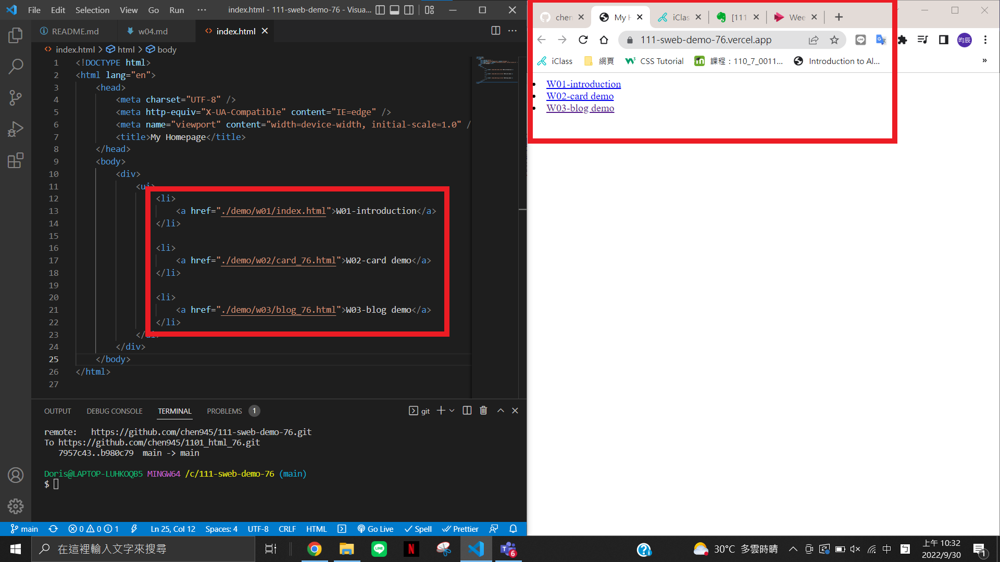
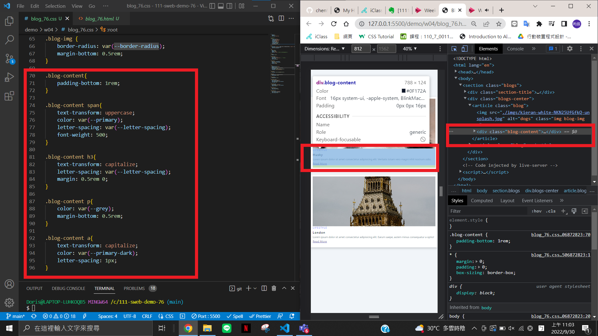
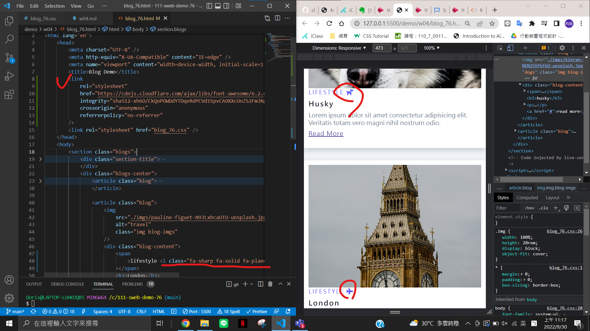
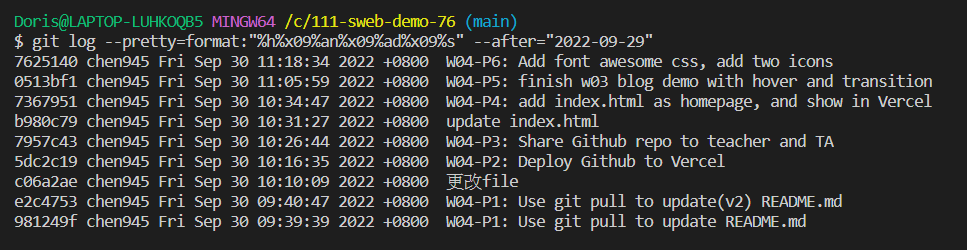

[GitHub URL](https://github.com/chen945/111-sweb-demo-76)

### W04-P1: Use git pull to update README.md


### W04-P2: Deploy Github to Vercel


### W04-P3: Share Github repo to teacher and TA


### W04-P4: add index.html as homepage, and show in Vercel



### W04-P5: finish w03 blog demo with hover and transition



### W04-P6: Add font awesome css, add two icons



### last log



```
$ git log --pretty=format:"%h%x09%an%x09%ad%x09%s" --after="2022-09-29"
7625140 chen945 Fri Sep 30 11:18:34 2022 +0800  W04-P6: Add font awesome css, add two icons
:...skipping...
7625140 chen945 Fri Sep 30 11:18:34 2022 +0800  W04-P6: Add font awesome css, add two icons
0513bf1 chen945 Fri Sep 30 11:05:59 2022 +0800  W04-P5: finish w03 blog demo with hover and transition
7367951 chen945 Fri Sep 30 10:34:47 2022 +0800  W04-P4: add index.html as homepage, and show in Vercel
b980c79 chen945 Fri Sep 30 10:31:27 2022 +0800  update index.html
7957c43 chen945 Fri Sep 30 10:26:44 2022 +0800  W04-P3: Share Github repo to teacher and TA
5dc2c19 chen945 Fri Sep 30 10:16:35 2022 +0800  W04-P2: Deploy Github to Vercel
c06a2ae chen945 Fri Sep 30 10:10:09 2022 +0800  更改file
e2c4753 chen945 Fri Sep 30 09:40:47 2022 +0800  W04-P1: Use git pull to update(v2) README.md
981249f chen945 Fri Sep 30 09:39:39 2022 +0800  W04-P1: Use git pull to update README.md
```
