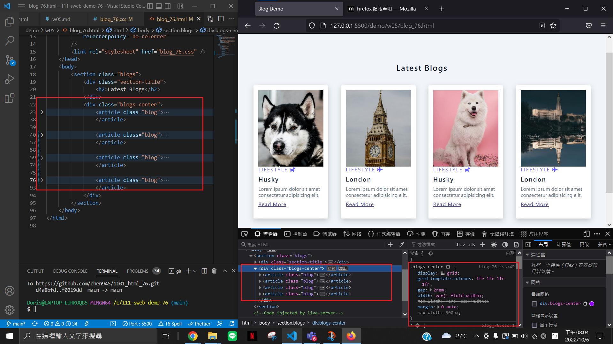

### W05-P1: add w04 link in index.html


### W05-P2: get 9 photo using small sizes


### W05-P3: Use grid to show 4 photos in a row



### W05-P4: add w05 link in index.html ,and show it in Vercel


### W05-P5: Using css grid with minmax to display 9 photos


### W05 last_log


```
$  git log --pretty=format:"%h%x09%an%x09%ad%x09%s" --after="2022-10-05"
a2c5ff7 chen945 Thu Oct 6 21:26:26 2022 +0800   W05-P5: Using css grid with minmax to display 9 photos
6c9a861 chen945 Thu Oct 6 20:08:57 2022 +0800   W05-P4: add w05 link in index.html ,and show it in Vercel
1c0661d chen945 Thu Oct 6 20:06:28 2022 +0800   W05-P3: Use grid to show 4 photos in a row
f0219dd chen945 Thu Oct 6 19:33:56 2022 +0800   W05-P2: get 9 photo using small sizes
d4a8bfd chen945 Thu Oct 6 18:57:59 2022 +0800   W05-P1: add w04 link in index.html
```
