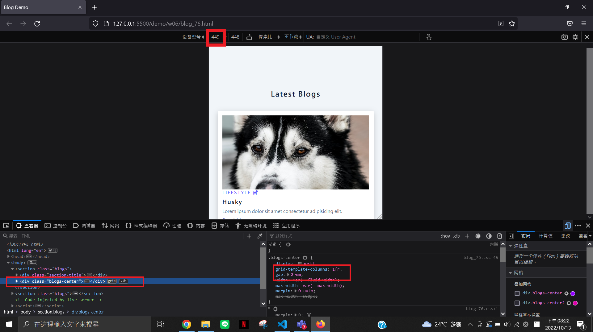
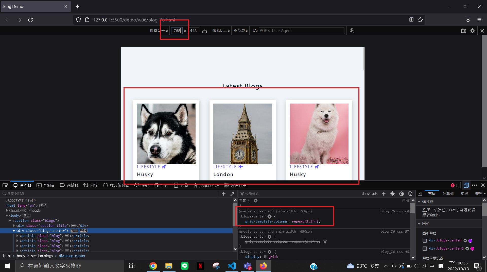
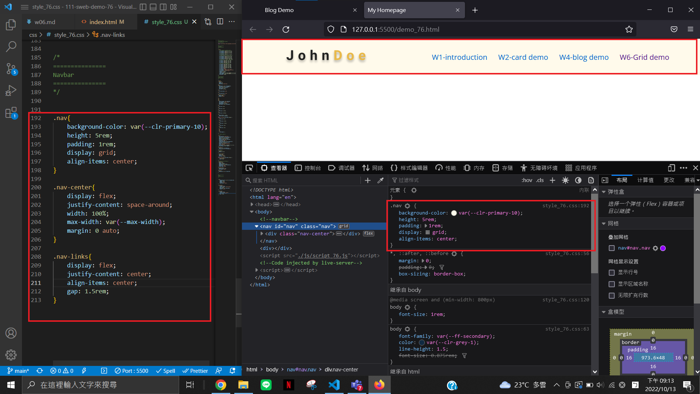
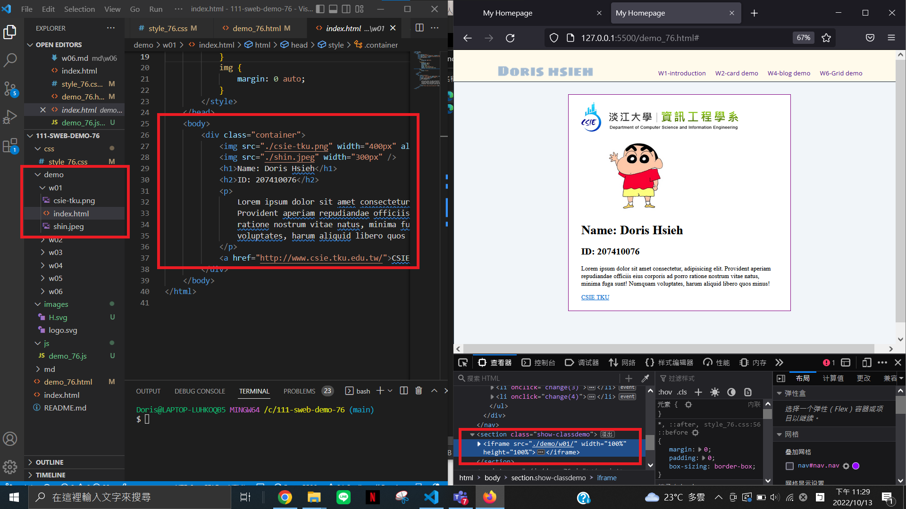
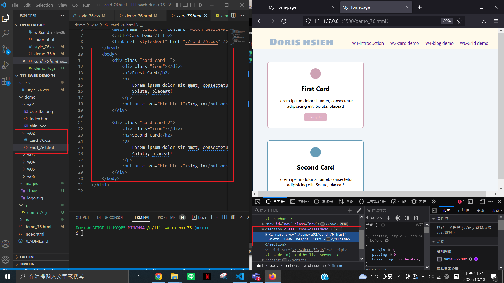
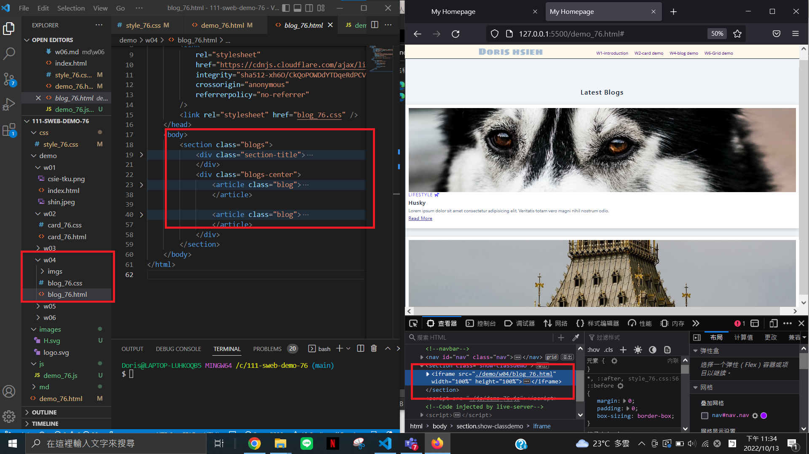
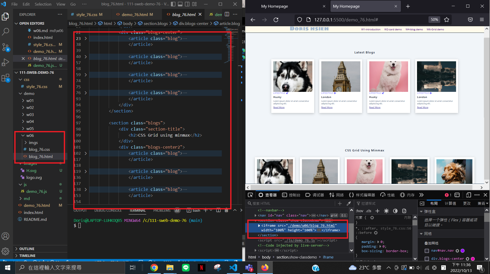

### W06-P1: add 3 breakpoints for different devices






### W06-P2: add navbar for demo links



### W06-P3: run 4 classdemo one by one






### W06-P4: w06 all log


```
$ git log --pretty=format:"%h%x09%an%x09%ad%x09%s" --after="2022-10-12"
1de1a4e chen945 Thu Oct 13 23:39:53 2022 +0800  W06-P3: run 4 classdemo one by one
448d0d7 chen945 Thu Oct 13 21:15:16 2022 +0800  W06-P2: add navbar for demo links
ca9d65a chen945 Thu Oct 13 20:40:41 2022 +0800  W06-P1: add 3 breakpoints for different devices
```
