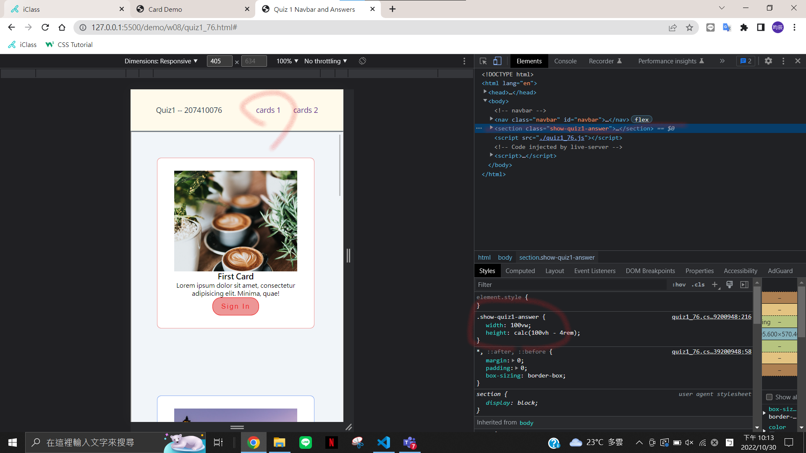

### w08-P1: navbar with card1 and card2





### w08-P2: fixed navbar setup and two sections with two links


### w08-P3: define css variables for .btn-1, .btn-2, .btn3


### git log

```
$ git log --pretty=format:"%h%x09%an%x09%ad%x09%s" --after="2022-11-02"
2bf9ddc chen945 Thu Nov 3 16:11:16 2022 +0800   w08-P3: define css variables for .btn-1, .btn-2, .btn3
c91a894 chen945 Thu Nov 3 15:31:28 2022 +0800   ### w08-P2: fixed navbar setup and two sections with two links
7d4f32a chen945 Thu Nov 3 15:21:28 2022 +0800   w08-P1: navbar with card1 and card2

```
