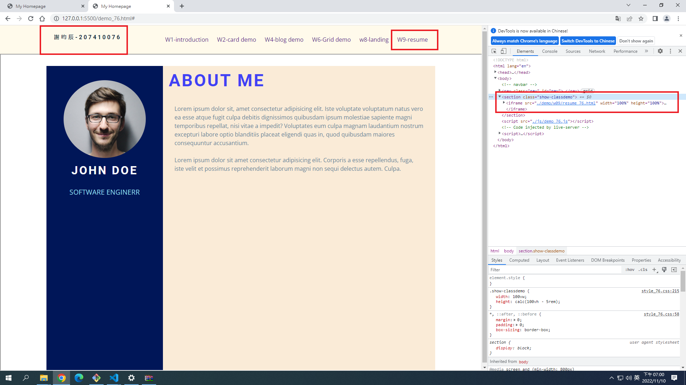
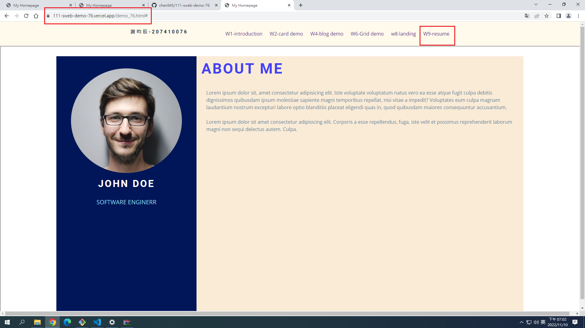
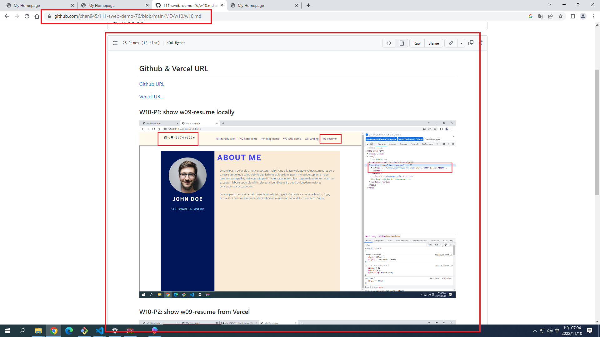
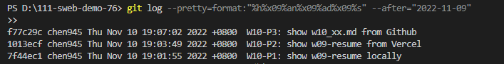

## Github & Vercel URL

[Github URL](https://github.com/chen945/111-sweb-demo-76)

[Vercel URL](https://111-sweb-demo-76.vercel.app/)

### W10-P1: show w09-resume locally



### W10-P2: show w09-resume from Vercel



### W10-P3: show w10_xx.md from Github



### W10-logs: show all logs of Week 9


```
PS D:\111-sweb-demo-76> git log --pretty=format:"%h%x09%an%x09%ad%x09%s" --after="2022-11-09"
>> 
f77c29c chen945 Thu Nov 10 19:07:02 2022 +0800  W10-P3: show w10_xx.md from Github
1013ecf chen945 Thu Nov 10 19:03:49 2022 +0800  W10-P2: show w09-resume from Vercel
7f44ec1 chen945 Thu Nov 10 19:01:55 2022 +0800  W10-P1: show w09-resume locally
```
