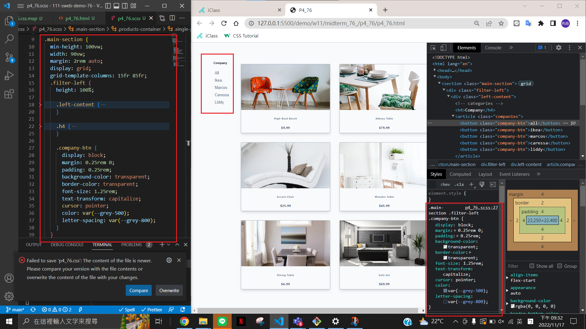

### W11-P1: answer of p2_xx using scss


### W11-P2: answer of p3_xx using scss


### W11-P3: answer of p4_xx using scss



### last log
```
$git log --pretty=format:"%h%x09%an%x09%ad%x09%s" --after="2022-11-09"


```


---
### 如何監聽
```
sass --watch scss:css
```
再Ctrl+S 會自動跳出監聽CSS(css記得先全部刪掉)