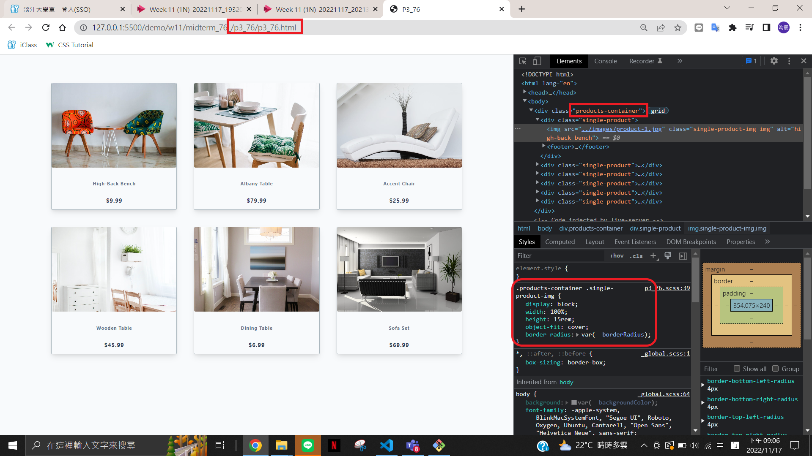

### W11-P1: answer of p2_xx using scss


### W11-P2: answer of p3_xx using scss



### W11-P3: answer of p4_xx using scss


### last log

```
$ git log --pretty=format:"%h%x09%an%x09%ad%x09%s" --after="2022-11-16"
7239397 chen945 Thu Nov 17 21:34:46 2022 +0800  W11-P3: answer of p4_xx using scss
7cb308f chen945 Thu Nov 17 21:09:13 2022 +0800  W11-P2: answer of p3_xx using scss
c66b412 chen945 Thu Nov 17 20:48:50 2022 +0800  W11-P1: answer of p1_xx using scss
```


---
### 如何監聽
```
sass --watch scss:css
```
再Ctrl+S 會自動跳出監聽CSS(css記得先全部刪掉)