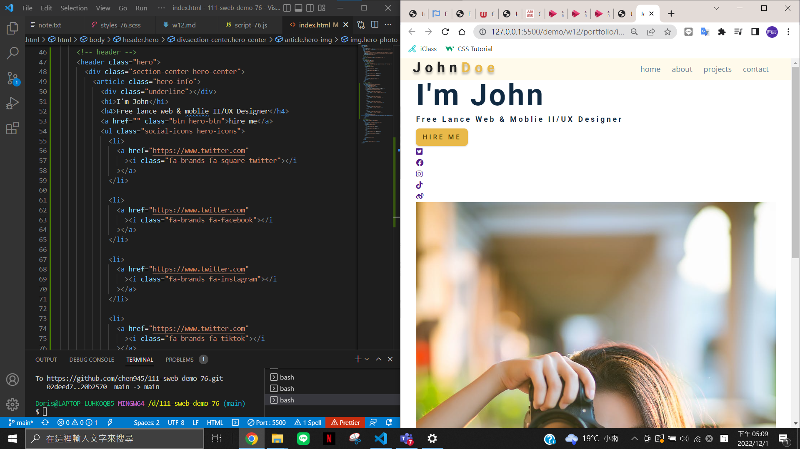
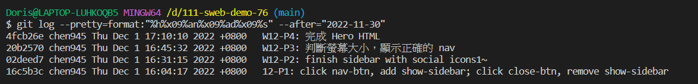

### W12-P1: click nav-btn, add show-sidebar; click close-btn, remove show-sidebar


### W12-P2: finish sidebar with social icons


### W12-P3: 判斷螢幕大小，顯示正確的 nav


### W12-P4: 完成 Hero HTML


### git log
```
$ git log --pretty=format:"%h%x09%an%x09%ad%x09%s" --after="2022-11-30"
4fcb26e chen945 Thu Dec 1 17:10:10 2022 +0800   W12-P4: 完成 Hero HTML
20b2570 chen945 Thu Dec 1 16:45:32 2022 +0800   W12-P3: 判斷螢幕大小，顯示正確的 nav
02deed7 chen945 Thu Dec 1 16:31:15 2022 +0800   W12-P2: finish sidebar with social icons1~
16c5b3c chen945 Thu Dec 1 16:04:17 2022 +0800   12-P1: click nav-btn, add show-sidebar; click close-btn, remove show-sidebar
```
