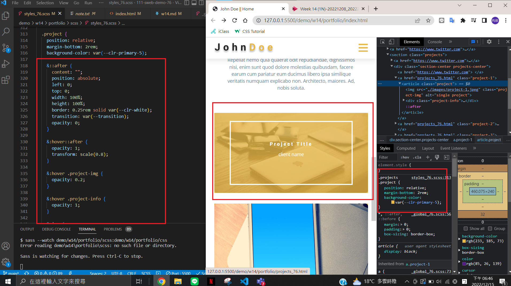
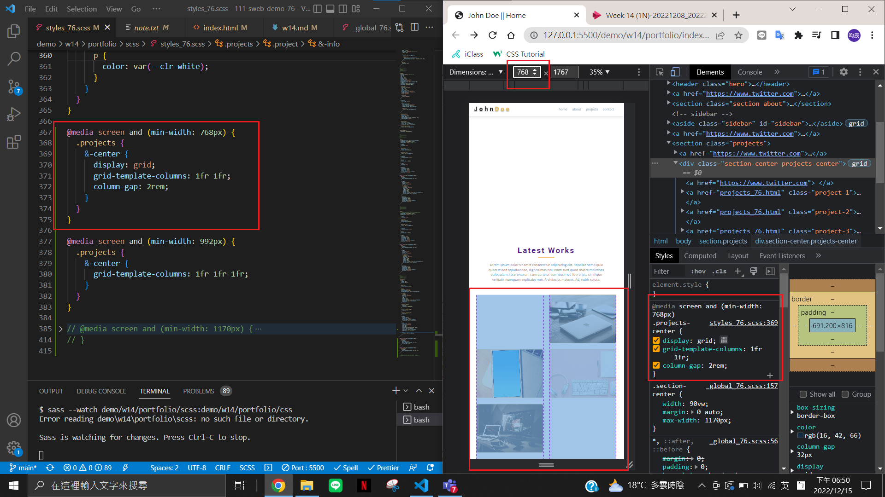
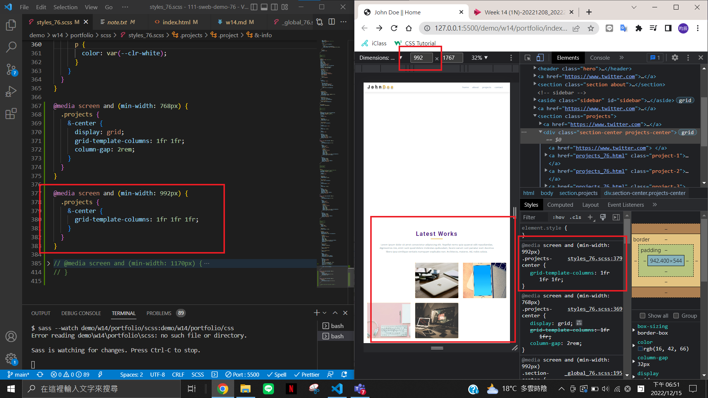
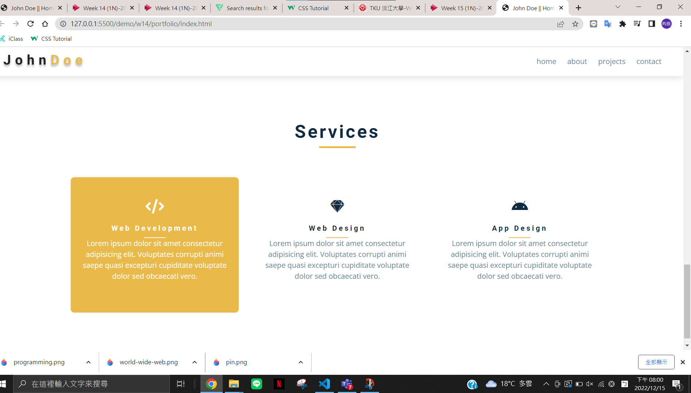
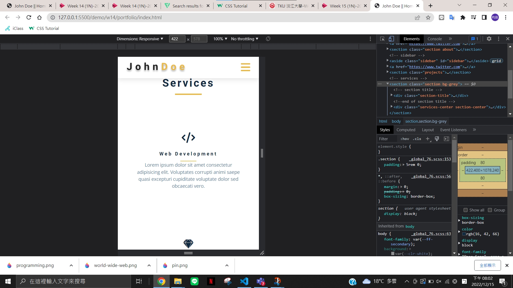

### W14-P1: html for projects section


### W14-P2: projects section for phone


### W14-P3: projects section for another three breakpoints




### W14-P4: service section with 2 breakpoints (done by students)






### git log
```
b585b3e chen945 Thu Dec 15 20:03:57 2022 +0800  W14-P4: service section with 2 breakpoints (done by students)
6f4df68 chen945 Thu Dec 15 18:58:55 2022 +0800  W14-P3: projects section for another three breakpoints
46a3973 chen945 Thu Dec 15 18:28:08 2022 +0800  W14-P2: projects section for phone
0b8d017 chen945 Thu Dec 15 17:05:57 2022 +0800  W14-P1: html for projects section

```
