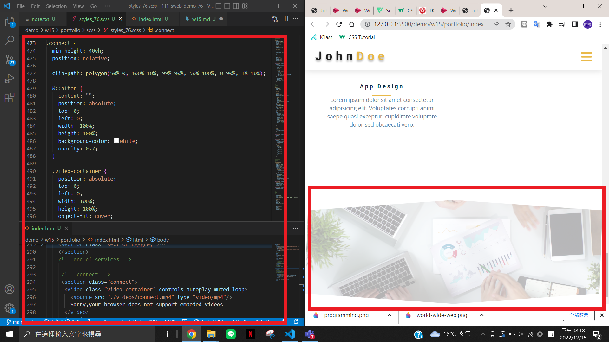

### W15-P1: connect section using mp4 video



### W15-P2: add video banner


### W15-P3: show contact_xx.html with navbar and footer with date shown in year
 


### W15-P4: 完成 skills 進度條


### W15-P5: 完成 timeline 時間軸


### git log
```
$ git log --pretty=format:"%h%x09%an%x09%ad%x09%s" --after="2022-12-14"
2318a91 chen945 Sat Dec 17 21:00:00 2022 +0800  ### W15-P5: <E5><AE><8C><E6><88><90> timeline <E6><99><82><E9><96><93><E8><BB><B8>
9067095 chen945 Sat Dec 17 20:29:15 2022 +0800  W15-P4: <E5><AE><8C><E6><88><90> skills <E9><80><B2><E5><BA><A6><E6><A2><9D>
aab9416 chen945 Thu Dec 15 21:03:06 2022 +0800  show contact_xx.html with navbar and footer with date shown in year
3f78da9 chen945 Thu Dec 15 20:31:54 2022 +0800  W15-P2: add video banner
7e6e8f3 chen945 Thu Dec 15 20:20:02 2022 +0800  W15-P1: connect section using mp4 video~
b585b3e chen945 Thu Dec 15 20:03:57 2022 +0800  W14-P4: service section with 2 breakpoints (done by students)
6f4df68 chen945 Thu Dec 15 18:58:55 2022 +0800  W14-P3: projects section for another three breakpoints
46a3973 chen945 Thu Dec 15 18:28:08 2022 +0800  W14-P2: projects section for phone
0b8d017 chen945 Thu Dec 15 17:05:57 2022 +0800  W14-P1: html for projects section
```

