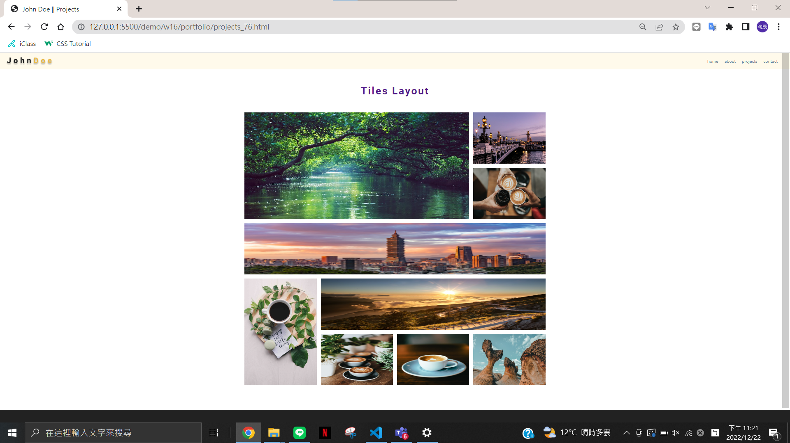
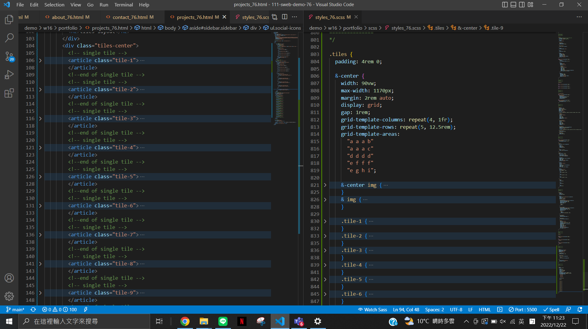
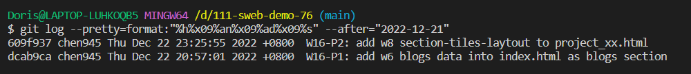

### W16-P1: add w6 blogs data into index.html as blogs section


### W16-P2: add w8 section-tiles-laytout to project_xx.html



### git log
```
$ git log --pretty=format:"%h%x09%an%x09%ad%x09%s" --after="2022-12-21"
609f937 chen945 Thu Dec 22 23:25:55 2022 +0800  W16-P2: add w8 section-tiles-laytout to project_xx.html
dcab9ca chen945 Thu Dec 22 20:57:01 2022 +0800  W16-P1: add w6 blogs data into index.html as blogs section
```

